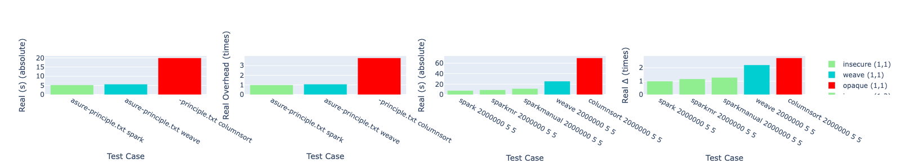

# Demo Instructions for Weave Evaluation

## 🛠 Getting Started

1. **SSH into the container** using the provided DNS name and your credentials:

   ```bash
   ssh <your_username>@<your_dns_name>
   ```

2. **Change to root and navigate to workspace**:

   ```bash
   sudo -i
   cd /workspace
   ```

3. **Run the evaluation script**:

   ```bash
   ./run-helloworld-eval.sh
   ```

This script automates the full demo test.

> ⏱ **Time required**: \~10–16 minutes

After the script finishes, CSV files containing the execution times of each test case will be generated for use in plotting.

---

## 📊 Visualizing Results

Weave hosts a **plotting web UI** at:

```
https://<your_dns_name>:9090
```

You can create plots similar to our paper's figures in both **single** and **array** formats.

### 🔹 Example 1: Multi-Plot Array

```http
http://weavec2-dns.eastus.azurecontainer.io:9090/plot-array?grid_x=3&grid_y=1&file_1_1=wordcount-err.csv&x_1_1=Test+Case&y_1_1=User+Overhead&file_1_2=sort-err.csv&x_1_2=Test+Case&y_1_2=User+Overhead&file_1_3=sort-err.csv&x_1_3=Test+Case&y_1_3=User+Overhead
```

Creates a 1×3 grid comparing the overheads of wordcount and sort.

### 🔹 Example 2: Single Plot

```http
http://weavec2-dns.eastus.azurecontainer.io:9090/?file=wordcount-err.csv&x=Test+Case&y=User+Overhead
```

Shows **absolute user time overheads** for wordcount.

---

## 🔍 Analyzing Logs and Configs of the Demo Test 

### ✅ Step 3 of helloworld eval: System Configuration Check

This confirms that Weave's configuration supports:

* Enclaved execution
* Secure network communication
* I/O encryption
* Worker authentication

#### Example Output:

```text
📍 Step 3: Check Gramine and encryption settings
  - spark.executor.gramine.enabled            true   # Enclaved execution using Gramine
  - spark.shuffle.service.enabled             true   # Secure shuffle among executors
  - spark.authenticate                        true
  - spark.authenticate.enableSaslEncryption   true   # SASL-based encryption for authentication
  - spark.io.encryption.enabled               true   # I/O encryption for data confidentiality at rest
  - spark.network.crypto.enabled              true   # Network-level encryption for data in transit
  - spark.authenticate.secret                 weave-evals  # Shared secret used for authentication
```

### ✅ Step 4 of helloworld eval: Enclave Sanity Test

If SparkPi runs successfully, Gramine is properly configured:

```text
📍 Step 4: Run SparkPi to generate the enclave context
🧮 Pi is roughly 3.1416907141690715
```

---

## 📈 Comparing Overhead Results in the output of helloworld eval script

### 🔁 Example Overhead Summaries

#### **Run 1**

```text
📊 sort-err.csv:
spark: 1.00x
sparkmr: 1.15x
sparkmanual: 1.62x
weave: 3.81x
columnsort: 8.93x

📊 wordcount-err.csv:
spark: 1.00x
weave: 0.99x
columnsort: 3.21x
```

#### **Run 2**

```text
📊 sort-err.csv:
spark: 1.00x
sparkmr: 1.08x
sparkmanual: 1.44x
weave: 3.20x
columnsort: 8.91x

📊 wordcount-err.csv:
spark: 1.00x
weave: 0.97x
columnsort: 3.38x
```

These results match expectations:

* Weave overhead on associative WordCount: **-3% to -1%**
* Weave overhead on Sort: **+122% to +135%**

These match:

* **Figure 5** (overall overheads)
* **Figure 8a left** (optimization effect)

---

## 🆚 Comparing to Opaque

Opaque's overhead:

* **550%–618%** of insecure baseline
* **2.47–6.57×** higher than Weave

> These results are consistent even at limited scale, while Opaque's overhead grows logarithmically with scale.

---

## 🎯 Customize Your Own Plots

The CSV includes both **absolute** and **relative overheads**.

### Example API URL:

```http
http://weavec2-dns.eastus.azurecontainer.io:9090/?file=wordcount-err.csv&x=Test+Case&y=User+(s)
```

### Example Use Cases:

 
 
* **a)** Absolute user time (WordCount)
* **b)** Relative user time overhead (WordCount)
* **c)** Absolute user time (Sort)
* **d)** Relative user time overhead (Sort)

You can download these plots as PNGs via the UI for visual comparison.

---

We hope this demo walkthrough helps you check the artifact functionality and partial matching to the paper results confidently!

